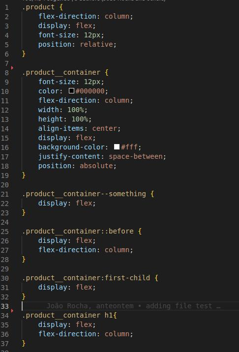
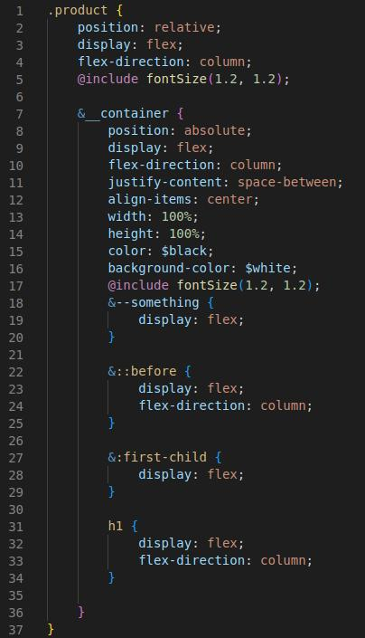

# CSS-refactor-to-SCSS

This a project only for test how fs can help in automate to refactoring css, adding variables and changing code structure. I was made this some years ago when I was young and learning about data structure and other contents like that so has so much for improve. Some day I will improve this project but for now will be for portfolio.

## How to use

give a path to your style.css in FILEPATH variable and a path to your colors.scss in COLORSPATH variable
after that

---
    node refactorCSS.js
---

## How this works
The code will read a CSS file and translate to a scss file, some changes will be made like the new scss file will be written using nesting, the colors variables will be replaced by variables if the color will finded on colors.scss, font-sizes will be replaced by a mixin fontSize, atrributes will be sort by RULES.orders this will become your attributes had a standard order by, your padding/margin/gap attributes in a range of 8/16/24/32/40 will be replaced by gutter spacing. Any of this "Rules" can be changed in Rules.js.

CSS file in left and in right the new SCSS file:

